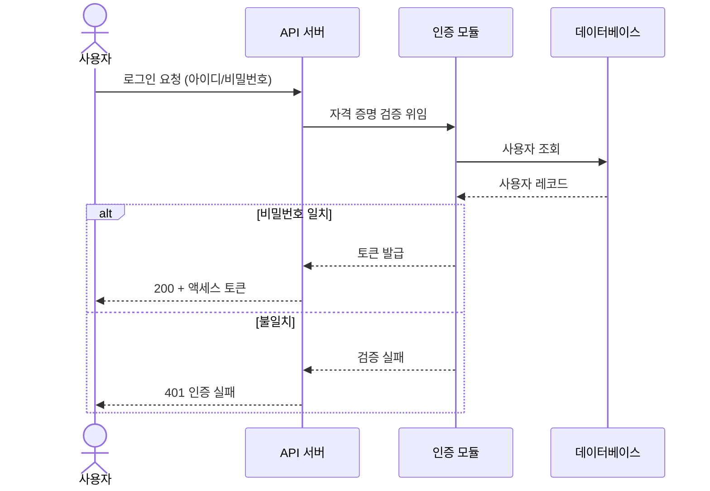
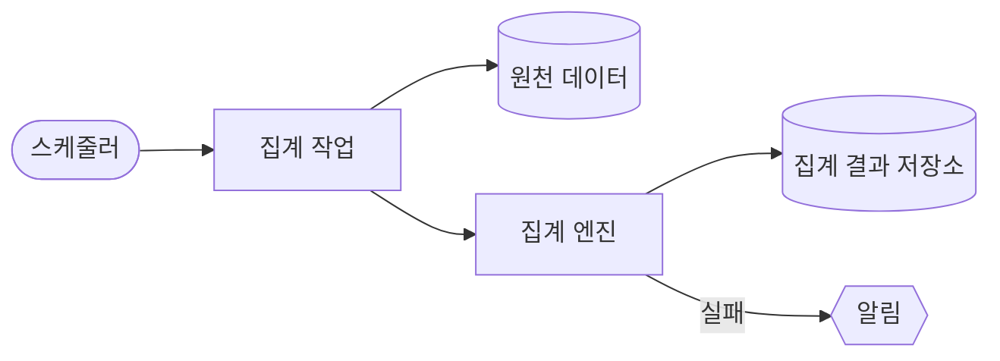

# How It Works — [프로젝트명]

> **동작 원리 문서(납품용).** 큰 기능 단위로, 다양한 트리거(사용자 요청·시스템 이벤트·
> 스케줄·외부 웹훅 등)에서 내부 컴포넌트들이 **어떻게 상호작용해 동작이 진행되는지**를
> 흐름도 기반으로 설명한다. 납품하는 쪽·받는 쪽 모두 동작 원리를 쉽게 이해하는 것이 목적이다.
>
> - **정적 구조**("무엇이 있나")는 `.claude/docs/02-architecture.md` 참조 — 이 문서는 **동적 흐름**("어떻게 동작하나")을 다룬다.
> - **실제 구현 근거로** 작성한다(추측 금지). 큰 기능의 흐름이 바뀌면 갱신한다(→ `.claude/rules/readme-sync.md`).
> - 다이어그램은 **Mermaid**로 그린다(GitHub 네이티브 렌더링, 텍스트 diff 용이, 외부 의존성 없음).

## 문서 규약

- 큰 기능(또는 트리거) 하나당 한 섹션. 각 섹션은 **트리거 → 컴포넌트 상호작용 → 결과**를 담는다.
- 각 섹션에 다이어그램 1개 + **평문 워크스루**(단계별 설명)를 함께 둔다.
- 관련 요구사항을 상호 링크한다(`FR-NN` / `REQ-N-M`) — 납품용 추적성.
- 트리거 유형 표기 권장: `사용자 요청` · `시스템 이벤트` · `스케줄` · `외부 웹훅` · `내부 큐`.

---

## [기능 A — 예: 사용자 로그인] (트리거: 사용자 요청)

- **관련 요구사항**: FR-NN, REQ-N-M
- **트리거**: 사용자가 [무엇]을 하면 시작된다.
- **결과**: [최종적으로 무엇이 일어나는가].

**워크스루**
1. 사용자가 자격 증명을 제출한다.
2. API 서버가 인증 모듈에 검증을 위임한다.
3. 인증 모듈이 DB에서 사용자를 조회해 비밀번호를 대조한다.
4. 일치하면 토큰을 발급해 반환하고, 불일치하면 401을 반환한다.

---

## [기능 B — 예: 야간 배치 집계] (트리거: 스케줄)

- **관련 요구사항**: FR-NN
- **트리거**: 매일 [시각]에 스케줄러가 기동한다.

**워크스루**
1. 스케줄러가 집계 작업을 기동한다.
2. 집계 엔진이 원천 데이터를 읽어 계산한다.
3. 결과를 저장소에 기록하고, 실패 시 알림을 발송한다.

---

<!-- 큰 기능/트리거가 늘면 위 형식으로 섹션을 추가하고, 관련 FR/REQ 상호 링크를 갱신한다. -->
